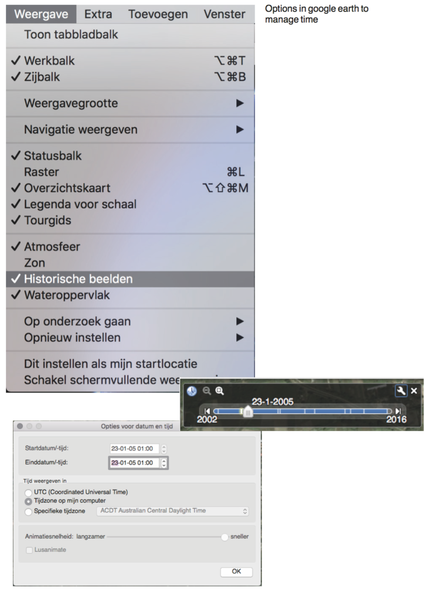

# CONCPEPT OF PROOF 

### SUMMARY PRESENTATION WEEK 2
GENERIC!!
- Timelapse tool which search for the change in the world overtime.
- For example ice/land/forest/cities
- How to find a place? Name of the place/forest/city? Coordinates?
PROOF OF CONCEPT -> POSSIBLE QUESTIONS
- How does the tool exactly work?
- What does the interface look like?
- In which form will the result be shown?
- How will the outcomes be arranged?
- What does it look like if there is no outcome from your search?
- What does the homepage look like?
- Tips for searching like autocompletion?

# Concept & tool questions

From our interest of Google maps, we where inspired to see how the earth changed over the last past decades, thanks to new technology we can now see what the impact is of human activity and the development on nature. We found it interesting to see, that the positive side and the negative side is viewable know days.
We love that the earth is suddenly an interactively explorable library. As designers we want to see what the boundaries are of this aspect. Some things are made clear, like climate changes, where some areas shrink or others expand. We as young designers see how important it is to be aware of change, we must be aware of what is changing and how we evolve with it, or what isn’t.
For who is it designed?
Our scraping tool give the user the experience of time, it shows the user the change over a period of time. The scraping tool is not based on a specific users, or with a specific use in case, it is designed to use the most common denominator, so the use case that will benefit the most users.

## How does the tool work?

The user types a coordinate into a search bar, that that will show you after you press enter a series of pictures that is shows you the change over time. After seeing the outcome, you are able to download the showed information.

## What is the input?

The user has to put a in a specific coordinate that will provide the user to see a specific area. That also means that the user is free to put in whatever coordinate that the user wants to use and in that case the area is unknown and provides the user to see unknown or unexplored places.

## What is the outcome?

The outcome of the tool will show you a specific area that shows you a change over a period of time. It will show you a specific outcome that is ordered in a certain chronological order.
In case that the user puts a wrong or non- excising coordinate into the search bar, it will tell you that this coordinate isn’t availed on this earth in perhaps sometimes a not really expected way.
How does the interface look like?
The interface is inspired on Google; simple to use.
There is a search bar where the user can put his coordinate in, and the interface is a friendly use system where the user quickly can see what he can do with the showed scraped information. It can be downloaded, or he can put a new coordinate into the tool, and start again with the process.

## Who are involved?
Carmen Steenbrink
Iris de Graaf
Marleen van Zalm
Google earth (engine)
Time laps
 
# How does the tool exactly work?

Rainbow Magicland, Via della Pace, Valmontone, Rome, Italië

![First working GIF] (images/first_timelapsegif.gif)

### Options in google earth to manage time

### What does it look like if there is no outcome from your search?

