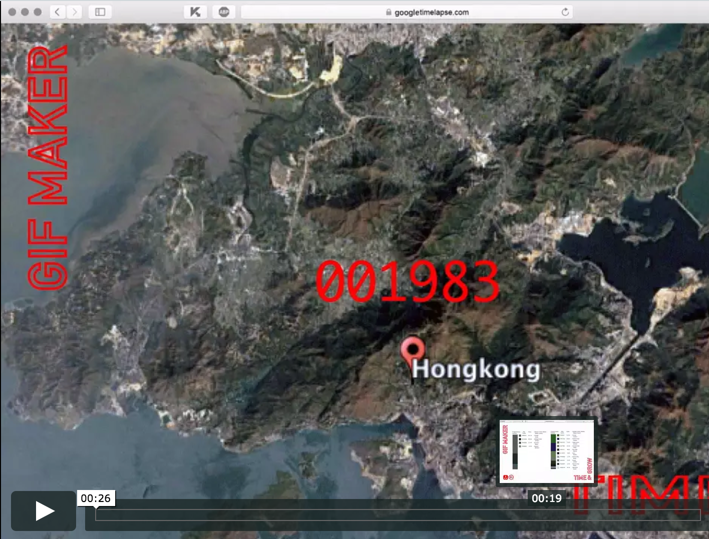

# scrapingTool_timelapseMaps

Project for Scraping Tools: Time-lapse for Maps

# TimelapseMaps
Tool for detecting changes in the world through a timelapse of Google maps.

# Synopsis
TimelapseMaps is a tool that creates a GIF file of the place you want to have a timelapse of.
It scrapes images of Google maps, and combine these into a GIF which you can download afterwards.

# Code Example
[Collection of code examples](https://github.com/ArtezGDA/scrapingTool_timelapseMaps/tree/master/example_code)

# Motivation
As Graphic Designers we wanted to develop our own skills and learn how to build our own tools. This way we can create applications or tools that suit our own specific workflow, in contrary to what most existing applications do: they're designed for a huge audience and therefore are made for the average user. This average user doesn't necessarily have to be you. That's why it's very convenient for a designer to be able to make their own tools that optimize their own specific workflow. 
That's why we decided to make this TimelapseMaps tool.  

We thought that it is very interesting to see differences in the world in a blink of an eye. By creating a tool where you can choose your own specific place to scrape the history of, it's easier to fulfill the needs of a huge group of designers and researchers. You can use this tool for a lot of different projects. To add some clear analyses of the change in time, we also want to involve an color analyses by pixels. You can see the amount of green/white grow and shrink. (forest/ice) Examples of things you can detect:
- Climat change
- Urbanisation
- Deforestation
- Sea level rise
- Secret buildings which are build
- Every change you want

# Demo of our TimelapseMaps tool

