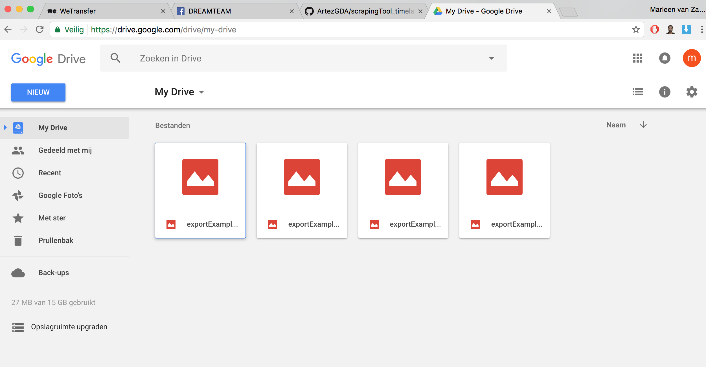

# Explanation python script about the dataset in combination with coordinates

In the python script you can specify which data set you use in combination of the place by the use of coordinates. On that basis, you run the script in the terminal, which stores the file in Google Drive, which is linked to your Earth engine account. In short; there is a way to scrape the data and get a visual outcome, this data is then saved as an .tiff file in your google drive. 

You can use different landsat (dataset) to get different outcomes. Every data set is specific in use (think about: year, location, data etc.).

[Code (link to Code)](https://github.com/ArtezGDA/scrapingTool_timelapseMaps/blob/master/example_code/Processing%20file%20images_from_movie/images_from_movie.pde)

