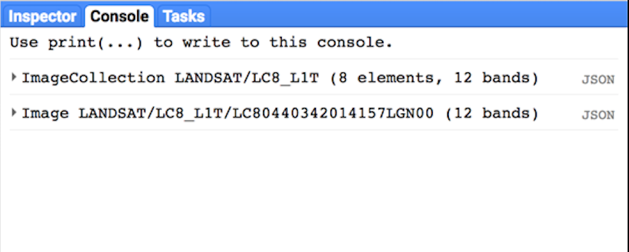

# How to find images in the big data sets of Google Engine

// var point = ee.Geometry.Point(5.9, 52.0);
var point = ee.Geometry.Point(-122.262, 37.8719);
var start = ee.Date('2014-06-01');
var finish = ee.Date('2014-10-01');
var filteredCollection = ee.ImageCollection('LANDSAT/LC8_L1T').filterBounds(point).filterDate(start, finish);
console.log(filteredCollection);
// var ic = ee.ImageCollection('LANDSAT/LC8_L1T');
// console.log(ic);
var first = filteredCollection.first();
console.log(first);
Map.addLayer(filteredCollection);

