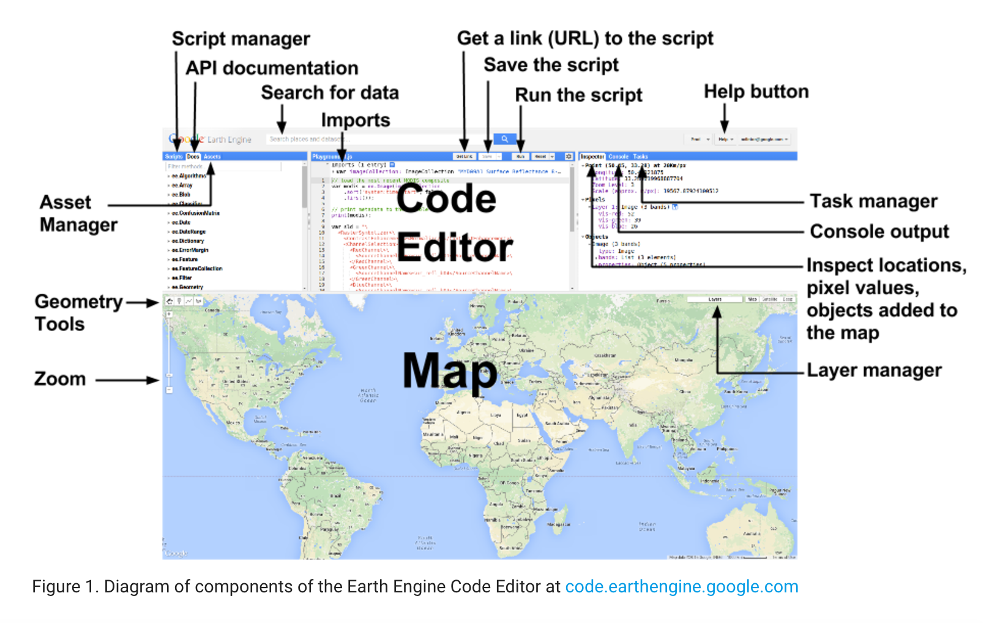
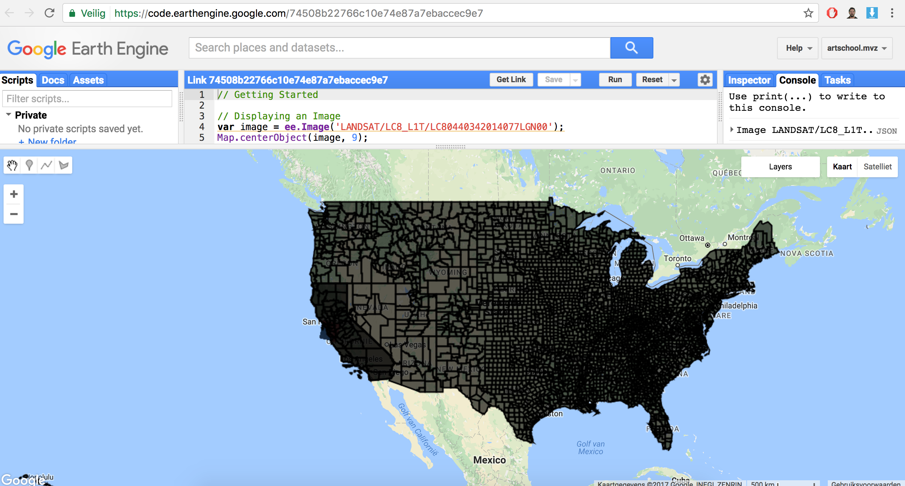
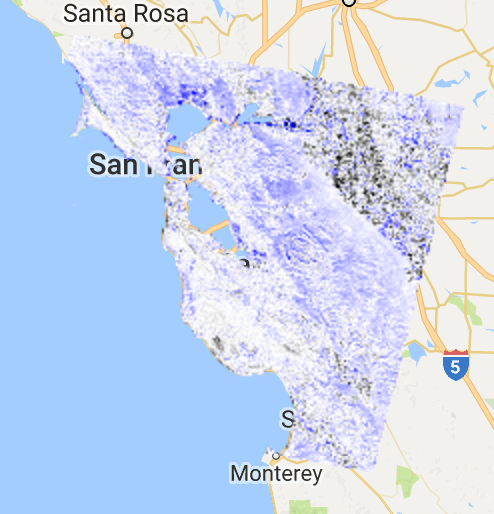
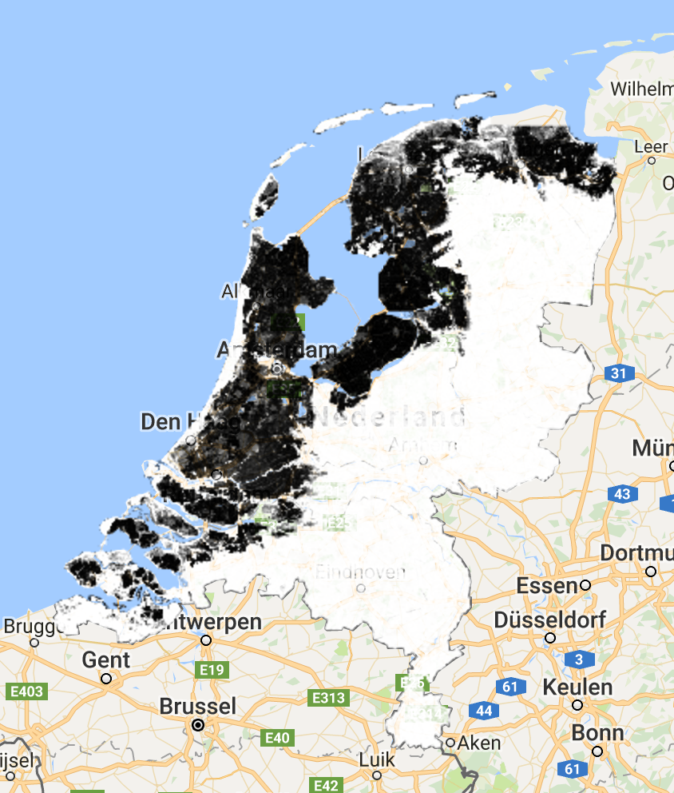

# Getting Started
### Displaying an Image

var image = ee.Image(‘LANDSAT/LC8_L1T/LC80440342014077LGN00’);
Map.centerObject(image, 9);
var vizParams = {bands: [‘B5’, ‘B4’, ‘B3’], min: 5000, max: 15000, gamma: 1.3};
Map.addLayer(image, vizParams, ‘Landsat 8 false color’);

### Displaying a FeatureCollection

var counties = ee.FeatureCollection (‘ft:1S4EB6319wWW2sWQDPhDvmSBIVrD3iEmCLYB7nMM’);
Map.addLayer(counties, {}, ‘counties’);

### Printing an ImageCollection

var collection = ee.ImageCollection(‘LANDSAT/LC8_L1T’);
print(collection.first());

### Constructing a Point and Dates

var point = ee.Geometry.Point(-122.262, 37.8719);
var start = ee.Date(‘2014-06-01’);
var end = ee.Date(‘2014-10-01’);

### Filtering and Sorting an ImageCollection

var filteredCollection = ee.ImageCollection(‘LANDSAT/LC8_L1T’)
.filterBounds(point)
.filterDate(start, end)
.sort(‘CLOUD_COVER’, true);
print(filteredCollection);
var first = filteredCollection.first();
print(first);

### Filtering a FeatureCollection

var featureCollection = ee.FeatureCollection(
‘ft:1fRY18cjsHzDgGiJiS2nnpUU3v9JPDc2HNaR7Xk8’);
var filter = ee.Filter.eq(‘Name’, ‘California’);
var filteredFC = featureCollection.filter(filter);
Map.addLayer(filteredFC, {}, ‘California’);

### This function gets NDVI from Landsat 5 imagery.

var getNDVI = function(image) {
return image.normalizedDifference([‘B4’, ‘B3’]);
};

### Load two Landsat 5 images, 20 years apart.

var image1 = ee.Image(‘LT5_L1T_TOA/LT50440341990155XXX03’);
var image2 = ee.Image(‘LT5_L1T_TOA/
LT50440342010162EDC00’);

### Compute NDVI from the scenes.

var ndvi1 = getNDVI(image1);
var ndvi2 = getNDVI(image2);

### Compute the difference in NDVI.

var ndviDifference = ndvi2.subtract(ndvi1);

### Load the land mask from the SRTM DEM.

var landMask = ee.Image(‘CGIAR/SRTM90_V4’).mask();

### Update the NDVI difference mask with the land mask.

var maskedDifference = ndviDifference.updateMask(landMask);

### Display the masked result.

var vizParams = {min: -0.5, max: 0.5, palette: [‘000000’, ‘FFFFFF’,
‘0000FF’]};
Map.setCenter(-122.2531, 37.6295, 9);
Map.addLayer(maskedDifference, vizParams, ‘NDVI difference’);

### Load a NAIP quarter quad, display.

var naip = ee.Image(‘AHN/AHN2_05M_INT’);
Map.setCenter(5.9052, 52.0035, 14);
Map.addLayer(naip, {}, ‘NAIP DOQQ’);

### Create the NDVI and NDWI spectral indices.

var ndvi = naip.normalizedDifference([‘N’, ‘R’]);
var ndwi = naip.normalizedDifference([‘G’, ‘N’]);

### Create some binary images from thresholds on the indices. This threshold is designed to detect bare land.

var bare1 = ndvi.lt(0.2).and(ndwi.lt(0.3));

### This detects bare land with lower sensitivity. It also detects shadows.

var bare2 = ndvi.lt(0.2).and(ndwi.lt(0.8));

### Define visualization parameters for the spectral indices.

var ndviViz = {min: -1, max: 1, palette: [‘FF0000’, ‘00FF00’]};
var ndwiViz = {min: 0.5, max: 1, palette: [‘00FFFF’, ‘0000FF’]};

### Mask and mosaic visualization images. The last layer is on top.

var mosaic = ee.ImageCollection([

### NDWI > 0.5 is water. Visualize it with a blue palette.

ndwi.updateMask(ndwi.gte(0.5)).visualize(ndwiViz),

### NDVI > 0.2 is vegetation. Visualize it with a green palette.

ndvi.updateMask(ndvi.gte(0.2)).visualize(ndviViz),

### Visualize bare areas with shadow (bare2 but not bare1) as gray.

bare2.updateMask(bare2.and(bare1.not())).visualize({palette:
[‘AAAAAA’]}),

### Visualize the other bare areas as white.

bare1.updateMask(bare1).visualize({palette: [‘FFFFFF’]}),
]).mosaic();
Map.addLayer(mosaic, {}, ‘Visualization mosaic’);

