# Python installation

The Earth Engine Python API is distributed as a Python package that is hosted on Github. The following instructions give an overview of installing the Google Earth Engine Python API. To use the Earth Engine Python API you'll need to install the client library and its dependencies on your computer and then set up authentication credentials.

# Mac OS X installation
## 1. Set up pip and Python

Check if you have Python 2.6 or 2.7:
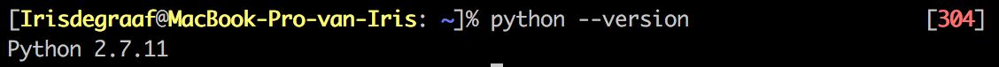

If needed, install 2.6 or 2.7 with apt-get. Then pip can be installed with:
sudo apt-get install python-pip

Mac OS X
The installation instructions assume that you are using Mac OS X 10.9+, the Homebrew Mac OS package manager, and the pip Python package manager. 

Homebrew can be installed with:
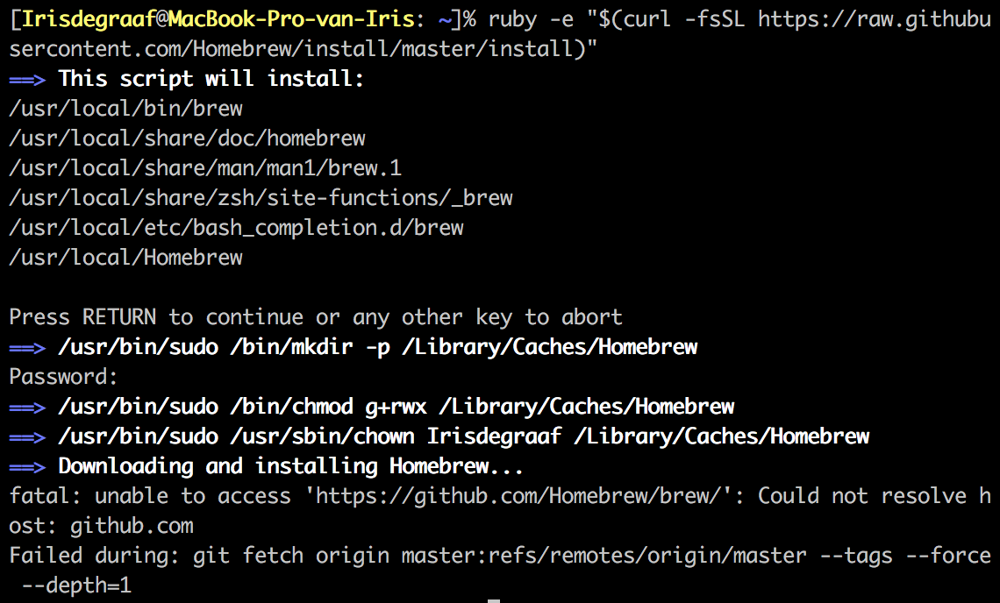

Then pip (and Python) can be installed with the following command:
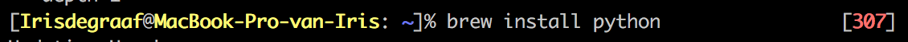

Note: Mac OS X ships with a default version of Python 2. Homebrew should install its own Python 2.7, which we'll be using to avoid interfering with the system-level configuration.

Regardless of you choice of package manager, verify that you have Python 2.6 or 2.7:
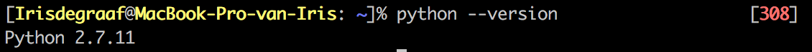

## 2. Install Google APIs Client Library

The Google APIs Client Library for Python provides support for authenticating to the Earth Engine servers. The library can be installed from the Python Package index by running the following command:
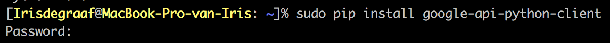

## 3. Ensure that a crypto library is available

pyCrypto
The pyCrypto library can be installed from the Python Package Index by running the following command:
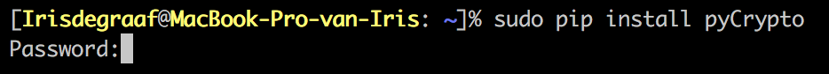

If there's an error, you'll need to install a Cryto library on your system. You can install either PyCrypto (recommended) or both OpenSSL and pyOpenSSL.

OpenSSL
OpenSSL is a toolkit that implements Secure Sockets Layer protocol. To check if the OpenSSL library is installed on your system, run the following command, which will print the version of the library:
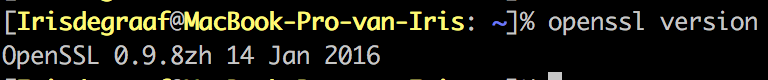

On Mac, the library can be installed with:
brew install openssl

pyOpenSSL
pyOpenSSL is a Python wrapper for the OpenSSL library. The pyOpenSSL library can be installed from the Python Package Index by running the following command:
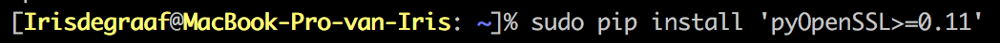

## 4. Install the Earth Engine Python API

The Earth Engine Python library can be installed from the Python Package Index by running the following command:
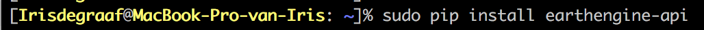

Setting Up Authentication Credentials
The Earth Engine APIs use the OAuth 2.0 protocol for authenticating clients. In order to authenticate, you will need to first setup a credentials file on your computer that authorizes access to Earth Engine on behalf of your Google account. You can trigger the process of creating the credentials file by calling the ee.Initialize() method from the following terminal command:
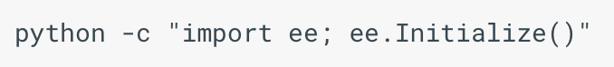

If you call ee.Initialize() without any arguments (as the preceding command does), the API tries to read credentials from a file located in a subfolder of your home directory. The location of the credentials file depends on your operating system. On Linux or OSX, the location is.

If a credentials file is not found, you will be presented with an error message that includes instructions for creating a new credentials file. The basic steps are:

	1	Open up a new terminal window, and copy the command that was presented in the error message into the new terminal window. This command runs a Python script (authenticate.py) that starts the process for creating a credentials file.
	2	The script (authenticate.py) attempts to open a web page (https://accounts.google.com/o/oauth2/auth). If you are not already signed in with your Google Account, you will be prompted to do so at this time. Once authenticated, the web page will ask you to authorize access to Earth Engine data.
	3	Click accept, and the web page will present you with an authorization code.
	4	Copy the authorization code, and paste in the terminal where the Python script (authenticate.py) is running. The script will write credentials file to the correct location on your file system.

Testing the installation
To test that authentication has been correctly setup, run the following script.
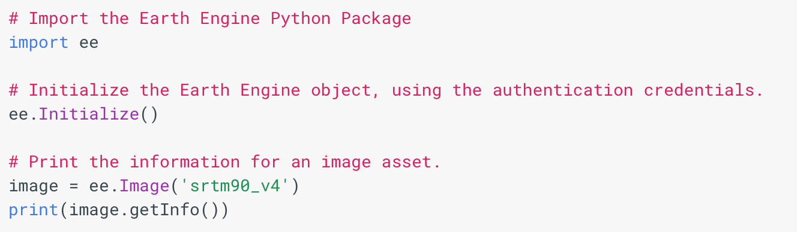

If everything is installed correctly, the metadata for an image should be printed.

Coding in the Python API
The Earth Engine Python API is identical to the Javascript API with a few exceptions. For example, you need to import the Earth Engine library to your Python scripts with

