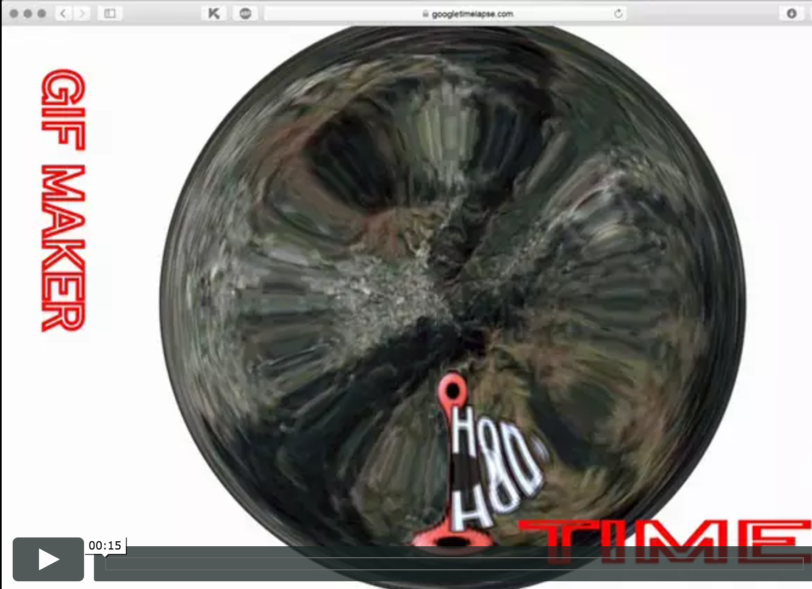
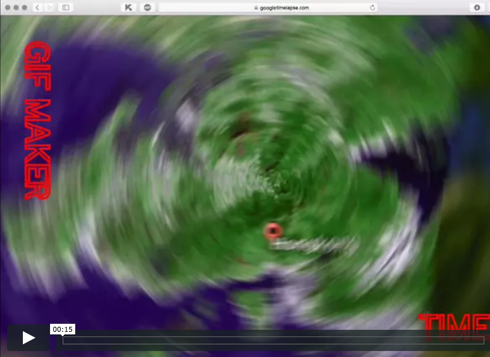
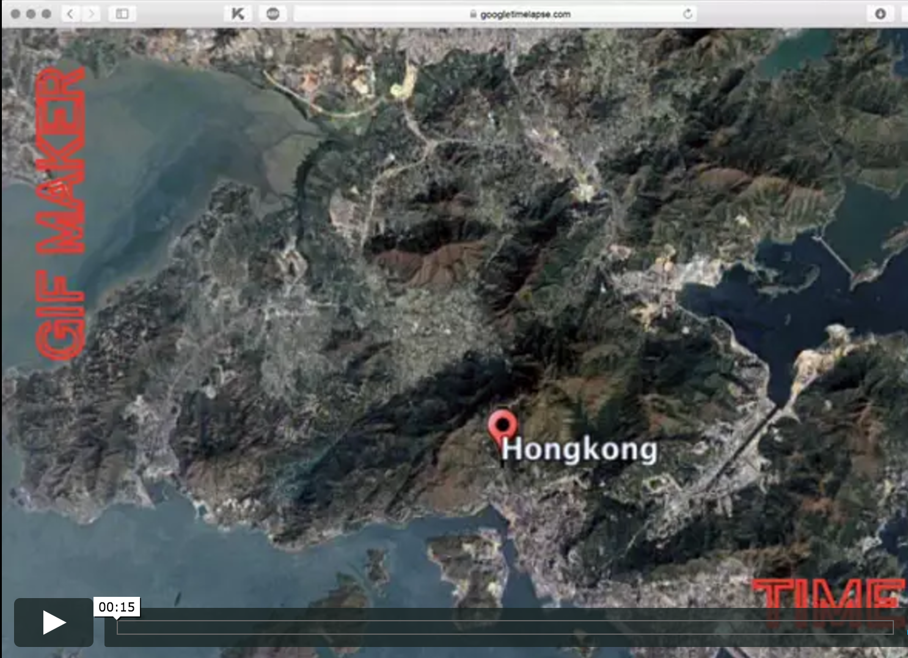
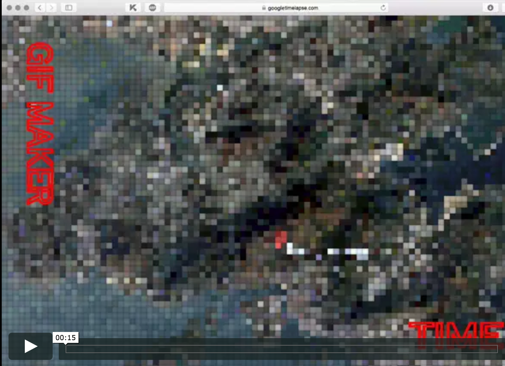
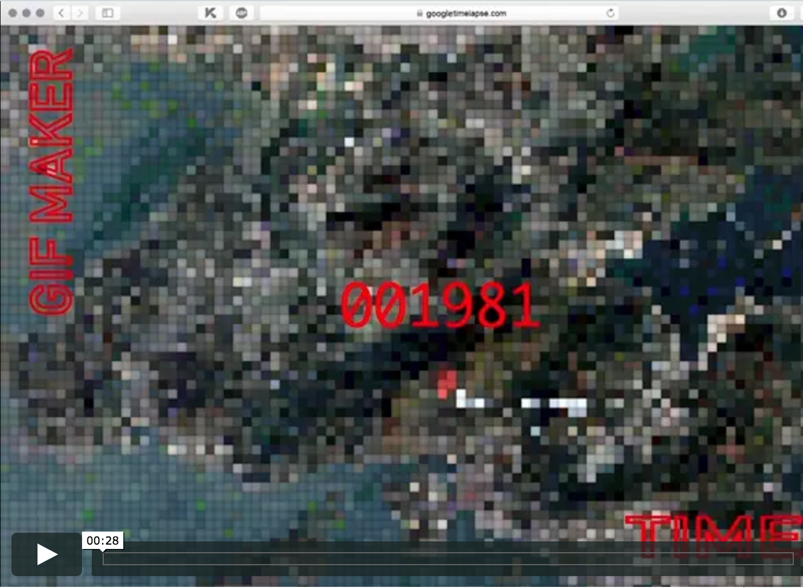

# Links to the Demo's of our scraping tool. 

These are sketches to see which design elements we want to implement in our final demo. We looked at how to present the GIF which is the outcome of the tool. The interface is simple and clear and the typography supports the usability and the concept of the interface. When the GIF played one time, there will appear a download button. You can download the Gif and use it for your own design or research purposes.

-  
-  
-  
-  
-  
 