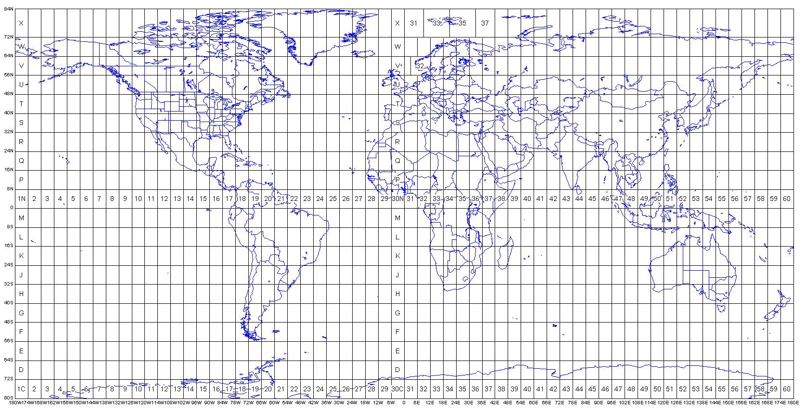
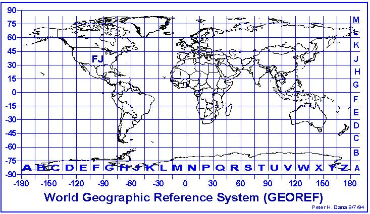

# Inspiration for the interface 

### Searchbar and download button

For the searchbar and the download button we wanted to use a really clear style so you'll instantly know how to use it and add to the usability of our tool. 

### Typography

The typography is based on old world maps with a kind of grids on it. These grids made us think about outlines. 

